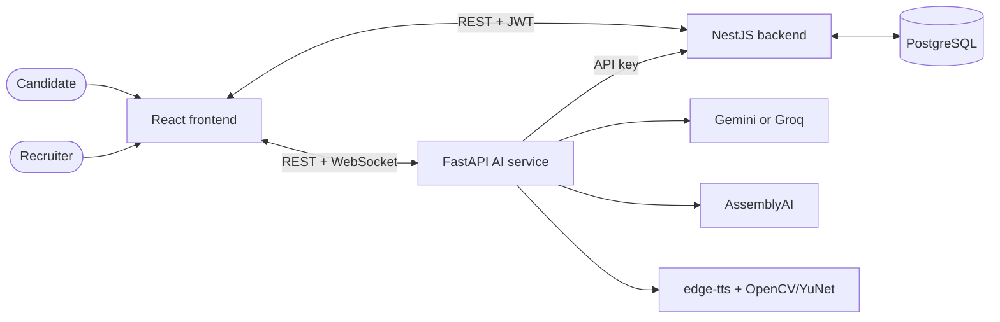

<div align="center">
  

# VU

### AI-powered virtual interviews, from application to evidence-backed review

[](https://vuapp.dev/)
[](https://drive.google.com/file/d/1JCtI74opyT0ndqJkITZ2ndIOklS3-ABd/view)
[](https://github.com/vu-app-dev/vu-app)

VU is a graduation project that helps hiring teams configure interviews, assess candidates consistently, and review structured evidence in one workspace.
</div>

## The platform

VU connects the complete interview workflow:

1. **Recruiters configure the role** — create jobs, reusable interview mocks, evaluation criteria, and public application links.
2. **Candidates apply and prepare** — submit their details and CV, then complete browser, microphone, and camera checks.
3. **The AI conducts the interview** — transcribes speech, generates adaptive questions, speaks through text-to-speech, and evaluates active competencies.
4. **The system assembles the evidence** — combines transcript, audio, video, CV, and session-integrity signals.
5. **Recruiters review the result** — inspect dimension scores, per-question feedback, summaries, recordings, and integrity status.

### What makes VU different

- **Behaviorally anchored scoring** across technical ability, communication, problem solving, structured thinking, and confidence.
- **Adaptive interview flow** with role-aware questions, controlled follow-ups, and CV-informed context.
- **Multi-modal evidence** from answers, speech patterns, face presence, gaze, and browser visibility events.
- **Separate competence and integrity signals** so suspicious-session indicators do not silently rewrite a candidate's score.
- **Two hiring workflows** for managed job applications and reusable mock interviews.
- **End-to-end recruiter workspace** for jobs, candidates, teams, permissions, and interview review.

## Architecture



| Layer | Core technologies |
| --- | --- |
| Web application | React 19, Vite 7, React Router, Recharts |
| Application API | NestJS 11, TypeORM, PostgreSQL, JWT |
| Interview intelligence | FastAPI, Gemini/Groq, AssemblyAI, edge-tts, OpenCV + YuNet |
| Local orchestration | Docker Compose |

## Repositories

| Repository | Responsibility |
| --- | --- |
| [`vu-app`](https://github.com/vu-app-dev/vu-app) | **Start here.** Full-stack Docker Compose orchestration and architecture documentation. |
| [`vu-frontend`](https://github.com/vu-app-dev/vu-frontend) | Recruiter dashboard, public application journey, and live interview experience. |
| [`vu-backend`](https://github.com/vu-app-dev/vu-backend) | Authentication, companies, jobs, mocks, candidates, files, and result persistence. |
| [`vu-ai`](https://github.com/vu-app-dev/vu-ai) | Interview sessions, STT/TTS, question generation, scoring, CV analysis, and integrity signals. |

## Run VU locally

### Prerequisites

- Git
- Docker 24+ with Docker Compose v2
- A Gemini or Groq API key
- An AssemblyAI API key

```bash
git clone --recursive https://github.com/vu-app-dev/vu-app.git
cd vu-app
cp .env.example .env
# Add your LLM and AssemblyAI credentials to .env
docker compose up --build
```

Once the containers are ready:

- Web app: [http://localhost:5173](http://localhost:5173)
- Backend API: [http://localhost:3000](http://localhost:3000)
- Swagger UI: [http://localhost:3000/docs](http://localhost:3000/docs)
- AI service health: [http://localhost:8000/health](http://localhost:8000/health)

Read the [system architecture](https://github.com/vu-app-dev/vu-app/blob/main/docs/architecture.md) and [AI scoring model](https://github.com/vu-app-dev/vu-app/blob/main/docs/ai-scoring.md) for the deeper technical design.

> [!IMPORTANT]
> VU provides decision support, not an autonomous hiring decision. Interview scores and integrity indicators should be reviewed by a person and interpreted alongside the full candidate context.

<p align="center">
  Built as a graduation project · <a href="https://github.com/vu-app-dev/vu-app/blob/main/LICENSE">MIT licensed</a>
</p>
